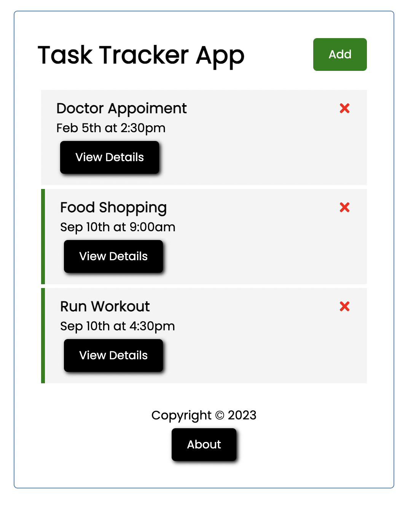

# Task Tracker App

By _**Nemanja Karaklajic**_
<hr>

### A simple interactive SPA written on React.js





## Technologies Used

* _HTML 5 / JSX_
* _CSS_
* _JS_ (ES6)
*  _React.js V18_ (CRA)

## Usage

### Install dependencies

```
npm install
```

### Run React dev server (http://localhost:3000)

```
npm start
```

### Run the JSON server (http://localhost:5000)

```
npm run server
```

### To build for production

```
npm run build
```

<!-- ## Deploy

Page has been deployed via [Github pages](https://letstayfoolish.github.io/task-tracker-app-react/) -->

## License


This project is licensed under the [Traversy Media](https://www.traversymedia.com/).

<hr>

Copyright (c) _2023_ _Nemanja Karaklajic_